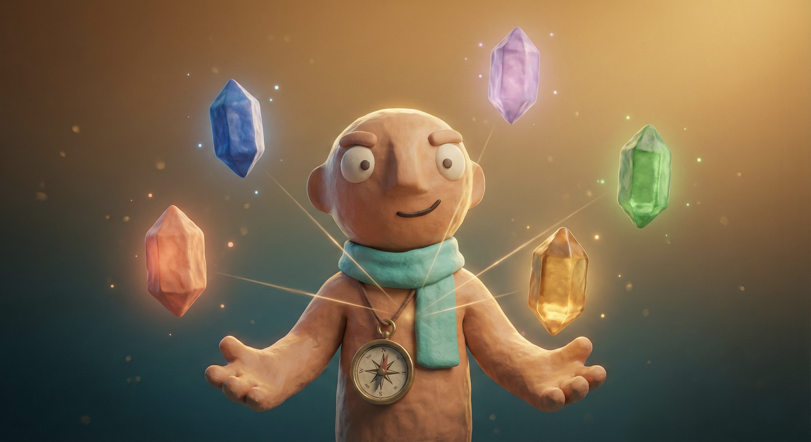
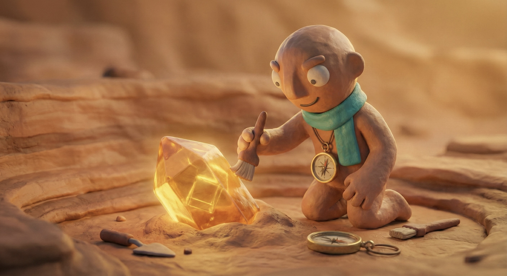

# The Strength Hack — Slide Skill

Use this when you build slide decks for **The Strength Hack**. Follow it as a binding visual contract: do not invent fonts, sizes, colors, or image treatments outside what is defined here.

This skill covers three things in detail:

1. **Fonts** — which families, how to load them, when to use each
2. **Type scale** — projection-appropriate sizes for 1920×1080 slides
3. **Imagery** — the Milo character and the exact frame/shadow treatment that makes him sit on a slide

For everything else (color, voice, tone) defer to the broader Strength Hack design system.

---

## 1. Fonts

The brand runs on **two** typefaces, both from Google Fonts. Do not substitute, do not add a third.

| Family | Role | Weights actually used |
|---|---|---|
| **DM Serif Display** | Every headline, every quote, every large number, every step number | 400 (regular + italic) |
| **Outfit** | Everything else — body, eyebrows, labels, buttons, captions, page numbers | 300, 400, 500, 600, 700 |

Italic on DM Serif Display is reserved for the emphasized clause inside a headline (`<em class="accent">`) and is tinted brand orange. One italic clause per headline maximum.

### Loading them

The included `colors_and_type.css` already loads both families and exposes them as variables:

```css
--font-dm-serif: 'DM Serif Display', Georgia, serif;
--font-outfit:   'Outfit', system-ui, sans-serif;
```

In a new deck, just link the stylesheet:

```html
<link rel="stylesheet" href="colors_and_type.css" />
```

If you can't drop the file in, paste this into the page `<head>`:

```html
<link rel="preconnect" href="https://fonts.googleapis.com" />
<link rel="preconnect" href="https://fonts.gstatic.com" crossorigin />
<link href="https://fonts.googleapis.com/css2?family=DM+Serif+Display:ital@0;1&family=Outfit:wght@300;400;500;600;700&display=swap" rel="stylesheet" />
```

### Usage rules

- **Headlines & numbers → DM Serif Display, weight 400, tight tracking** (`letter-spacing: -1.2px` to `-3px` depending on size).
- **Body & UI → Outfit.** Weight 400 for prose, 500 for emphasis, 600 for buttons / eyebrows / nav, 700 only on tag rows.
- **Eyebrow labels** are always Outfit 600, **uppercase**, `letter-spacing: 4px`, brand orange `#D4652A`. They sit above a headline and never below.
- **No third typeface.** No system fallback as a "design choice." No Inter, no Roboto, no Helvetica.

---

## 2. Type scale (1920×1080 slides)

These are the variables defined in `colors_and_type.css`. Every font-size in slide markup should reference one of these — never a raw px value.

```css
--type-display: 132px;   /* hero title, slide 1 only */
--type-title:    88px;   /* big section title */
--type-h2:       72px;   /* standard slide title */
--type-quote:    56px;   /* pulled quotes (italic DM Serif) */
--type-stat:    220px;   /* huge stat number */
--type-sub:      40px;   /* hero subhead, lede sentence */
--type-body:     30px;   /* slide body copy */
--type-small:    24px;   /* footnotes, source lines, page numbers */
--type-eyebrow:  24px;   /* eyebrow label above titles */
```

### Companion spacing

Pair the type scale with this padding/gap scale. Slides need much more breathing room than web pages — these numbers are deliberately generous.

```css
--pad-x:      120px;   /* left + right padding inside every slide */
--pad-top:    110px;   /* top padding */
--pad-bottom:  90px;   /* bottom padding */
--gap-title:   44px;   /* gap between eyebrow → title → subtitle */
--gap-item:    28px;   /* gap between items in a list / grid */
```

### Hard rules

- **24 px is the absolute floor.** Anything smaller fails projection legibility and will be flagged.
- **Titles get `text-wrap: balance` and tight tracking.** Tracking values: `-3px` for `--type-display`, `-1.8px` for `--type-title`, `-1.2px` for `--type-h2`. Line-height ≈ 1.0–1.06.
- **Body is `text-wrap: pretty`, `line-height: 1.4–1.5`, max-width ≈ 720 px.** Don't let a paragraph stretch the full 1680 px content width — it becomes unreadable.
- **One font-size per element type.** Two cards in the same row both use `--type-body`; never a 30 px card next to a 32 px card.

### Drop-in semantic classes

`colors_and_type.css` ships these — use them directly instead of restyling:

```html
<span class="eyebrow">Das Problem · Teil 1</span>
<h1 class="display">Vom Testergebnis zur <em class="accent">Team-Excellence</em>.</h1>
<h2 class="h2">Heroische Führung skaliert <em class="accent">nicht mehr</em>.</h2>
<p class="quote">„Exzellenz entsteht nicht durch das Ausmerzen von Schwächen."</p>
<p class="sub">Subhead / lede sentence.</p>
<p class="body">Body copy.</p>
<span class="small">Quelle · Gallup 2026</span>
```

---

## 3. Imagery — Milo and the frame treatment

The brand mascot is **Milo**: a 3D clay-rendered, smiling, bald figure in a teal scarf, juggling colored crystals against a warm gradient. Use the existing JPGs — never redraw him as SVG, never substitute a different illustration style.

### The four canonical Milo images

Drop these into an `assets/` folder next to your HTML:

| File | Mood | Use on |
|---|---|---|
| `milo-hero.jpg` | Juggling crystals — energetic, multi-color | Slide 1 (title), final CTA |
| `milo-strengths.jpg` | Polishing a single crystal — focused | "Stärken" / strengths slides, Seligman quote |
| `milo-teamwork.jpg` | Two figures / handing a crystal | Team-fit, collaboration slides |
| `milo-growth.jpg` | Crystal growing / lifted up — aspirational | Roadmap, outcomes, before→after |

Use **at most one Milo per slide**. Rotate which image you pick across the deck — repeating the same Milo on consecutive slides reads as a stuck render, not intentional rhythm.

### The frame treatment (the part that makes it look right)

Every Milo image sits inside a fixed frame. Three things make the treatment work and **all three are required**:

1. **Rounded corners** at `border-radius: 28px`.
2. **A warm dark backplate** behind the image — `background: #20322F` (a deep teal that matches the scarf). When the JPG has any transparency or letterboxing, the backplate is what you see; the image never sits on raw cream or charcoal.
3. **A heavy floating shadow** — `box-shadow: 0 20px 60px rgba(0, 0, 0, 0.4)`. This shadow is what lifts Milo off the slide. It is heavier than the design system's "card hover" shadow on purpose: hero imagery gets more weight than UI cards.

```css
.hero-image {
  position: relative;
  width: 100%;
  height: 100%;
  border-radius: 28px;
  overflow: hidden;
  background: #20322F;                       /* teal backplate */
  box-shadow: 0 20px 60px rgba(0, 0, 0, 0.4); /* hero shadow */
}
.hero-image img {
  width: 100%;
  height: 100%;
  object-fit: cover;     /* aspect-fill — Milo always fills the frame */
  display: block;
}
```

```html
<div class="hero-image">
  
</div>
```

### Sizing the frame on a slide

The frame stretches to the column it's placed in — give it a parent with explicit dimensions or an aspect ratio.

- **Slide-1 hero (split layout):** put the `.hero-image` in a 2-column grid where the right column is ~42% wide. Frame fills the column at native aspect (typically 4:5 or 1:1 — let the column height drive it).
- **Section dividers / portrait slides:** force the aspect with an inline override:
  ```html
  <div class="hero-image" style="aspect-ratio: 4 / 5; height: auto;">
    
  </div>
  ```
- **Full-bleed background variant:** the same frame at `border-radius: 0` and no shadow, sized to the full slide. Use this once per deck max — it's a heavy effect.

### Composition rules

- **Milo always faces toward the text**, never away from it. Flip the column order if needed (`flex-direction: row-reverse`) rather than mirroring the image.
- **Never overlay text directly on Milo.** Headlines sit beside the frame, not on top of it. If you need a caption, place it underneath in `--type-small` weight 600.
- **Never add a colored gradient over Milo.** The image already has its own warm gradient ground.
- **Section divider slides are the right place for a big Milo + a one-line title.** Title in `--type-title`, eyebrow above, no body copy.

### When you don't have the right Milo

If the slide concept doesn't map to one of the four canonical images, **leave the frame empty as a placeholder** — `.hero-image` with no `` — and ask the user for a new render. Do not generate a new Milo with SVG, AI image gen, or stock photography.

---

## 4. Quick checklist before shipping a slide

- [ ] Stylesheet linked: `<link rel="stylesheet" href="colors_and_type.css" />`
- [ ] Every font-size references a `--type-*` variable
- [ ] No font-size below 24 px anywhere on the slide
- [ ] Headline uses DM Serif Display via `.display` / `.title` / `.h2`
- [ ] Body and labels use Outfit
- [ ] Eyebrow is uppercase, 4 px tracking, brand orange, **above** the title
- [ ] If the slide has a Milo, it's wrapped in `.hero-image` (rounded 28 px + teal backplate `#20322F` + `0 20px 60px rgba(0,0,0,0.4)` shadow)
- [ ] Image is `object-fit: cover`, never stretched
- [ ] Padding scale uses `--pad-*` and `--gap-*` — not custom px values

---

## Files in this handoff

| Path | What it is |
|---|---|
| `SKILL.md` | This document |
| `colors_and_type.css` | All font + type-scale + spacing variables, and the semantic classes (`.display`, `.h2`, `.quote`, `.eyebrow`, `.body`, `.small`, etc.) |
| `example-slide.html` | One working slide that demonstrates the fonts, the type scale, and the Milo frame in context. Open it to see what "right" looks like. |
| `assets/milo-hero.jpg` | Milo juggling crystals — slide 1 / hero |
| `assets/milo-strengths.jpg` | Milo polishing a crystal — strengths slides |
| `assets/milo-teamwork.jpg` | Milo collaboration — team slides |
| `assets/milo-growth.jpg` | Milo growth — roadmap / outcome slides |
| `assets/logo-mark-green.png` | Primary brandmark (compass-arrow, green gradient) |
